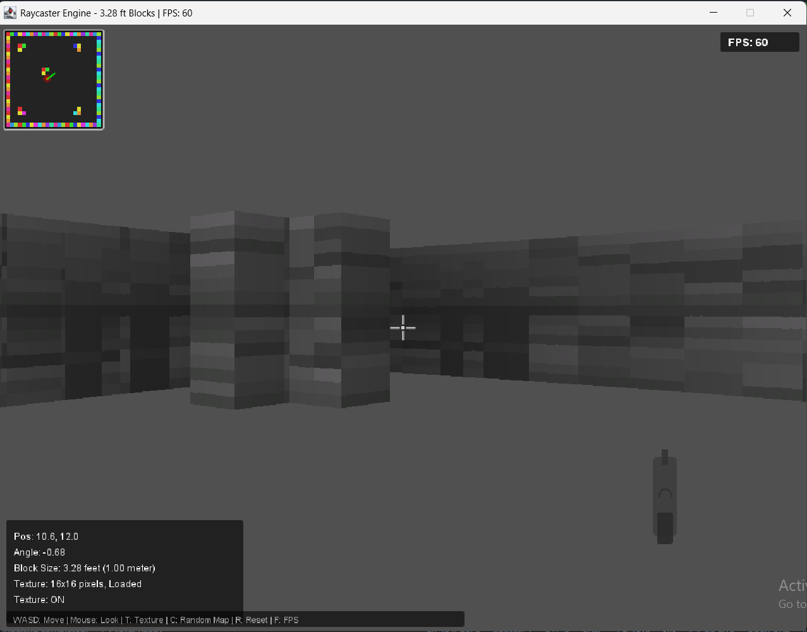

# Contributors

We appreciate everyone who has contributed to this project! 🎮

## Core Team

### Lead Developer
- **Name**: [Your Name]
- **Role**: Project Lead, Core Engine Developer
- **Contributions**:
  - Raycasting engine architecture
  - Java AWT/Swing implementation
  - Texture system design
  - Performance optimization
  - Project structure and documentation
  - 3.28 ft block rendering system

### Contributors

#### [Contributor Name]
- **Role**: Graphics & Visual Design
- **Contributions**:
  - Texture art and design
  - Color palette selection
  - UI/HUD design
  - Visual effects
  - Minecraft-style textures

#### [Contributor Name]
- **Role**: Game Logic & Mechanics
- **Contributions**:
  - Player movement system
  - Collision detection
  - Map generation
  - Control system
  - Weapon mechanics

#### [Contributor Name]
- **Role**: Testing & Quality Assurance
- **Contributions**:
  - Bug reporting
  - Performance testing
  - Feature testing
  - Documentation review
  - User experience testing

## Special Thanks

### Inspirations
- **Lode Vandevenne** - Original raycasting tutorial that made this possible
- **Mojang Studios** - Minecraft block rendering inspiration
- **id Software** - Wolfenstein 3D (original raycasting game)
- **John Carmack** - Pioneering 3D game engines

### Libraries & Tools
- **Java AWT/Swing** - Rendering framework
- **Java Sound API** - Audio support (planned)
- **Git** - Version control
- **GitHub** - Hosting and collaboration

## How to Contribute

### Reporting Issues
1. Check existing issues before creating a new one
2. Use the issue template
3. Include:
   - Description of the problem
   - Steps to reproduce
   - Error messages (if any)
   - Screenshots (if applicable)
   - System information (OS, Java version)

### Code Contributions

#### Getting Started
1. Fork the repository
2. Create a feature branch: `git checkout -b feature/your-feature`
3. Make your changes
4. Test thoroughly
5. Submit a pull request

#### Coding Standards
```java
// Use meaningful variable names
// Add comments for complex logic
// Follow Java naming conventions
// Keep methods focused and concise
// Use proper indentation (4 spaces)
// Add Javadoc for public methods
```

#### Pull Request Checklist
- [ ] Code follows style guidelines
- [ ] Tests pass
- [ ] Documentation updated
- [ ] No new warnings
- [ ] Branch is up to date with main

### Documentation Contributions
- Update README.md for new features
- Update CHANGELOG.md for changes
- Add comments to code
- Write tutorials or guides

### Design Contributions
- Create textures for the game
- Design UI elements
- Create color schemes
- Design map layouts

## Areas for Contribution

### High Priority
- [ ] Texture art and design
- [ ] Sound effects and music
- [ ] Bug fixes
- [ ] Performance optimization
- [ ] Documentation

### Medium Priority
- [ ] New game mechanics
- [ ] Additional map types
- [ ] Menu system
- [ ] Settings configuration
- [ ] Cross-platform testing

### Low Priority
- [ ] Mod support
- [ ] Advanced features
- [ ] Multiplayer
- [ ] Custom shaders

### image screenshot 

<div align="center">
    
</div>

## Recognition
All contributors will be recognized in:
- This CONTRIBUTORS.md file
- The README.md acknowledgments
- Release announcements
- Social media posts

## Code of Conduct

### Our Pledge
We as members, contributors, and leaders pledge to make participation in our community a harassment-free experience for everyone, regardless of age, body size, visible or invisible disability, ethnicity, sex characteristics, gender identity and expression, level of experience, education, socio-economic status, nationality, personal appearance, race, religion, or sexual identity and orientation.

### Our Standards
Examples of behavior that contributes to a positive environment:
- Using welcoming and inclusive language
- Being respectful of differing viewpoints
- Gracefully accepting constructive criticism
- Focusing on what is best for the community
- Showing empathy towards other community members

### Enforcement
Instances of abusive, harassing, or otherwise unacceptable behavior may be reported to the project team. All complaints will be reviewed and investigated promptly and fairly.

## Questions?
If you have any questions about contributing, please:
- Open an issue
- Send an email: [edulms.system.noreply@gmail.com]
- Join our Discord/Slack channel here (discord)[https://discord.gg/XaGapWkmy]

Thank you for contributing! 🎉

---

*Last Updated: 2026-08-27*